  

  

  

  

 

  
### 🌟 Quick Stats
  

---

  

## 🧑‍💻 About Me

  
<table>
<tr>
  <td>🌱</td>
  <td><b>Currently Learning</b></td>
  <td>C++, Python, TypeScript</td>
</tr>
<tr>
  <td>🎯</td>
  <td><b>Goal</b></td>
  <td>Becoming a full-stack developer</td>
</tr>
<tr>
  <td>🔭</td>
  <td><b>Current Focus</b></td>
  <td>learning new technologies</td>
</tr>
</table>

---

  

## 🚀 Tech Stack & Tools

### 💻 Programming Languages

  

### 🌐 Frameworks & Libraries

  

### 🛠️ Development Tools

  

### 🗃️ Databases

  

### 🖥️ Operating Systems

  

---

  

## 📊 GitHub Stats

  

<picture>
  <source media="(prefers-color-scheme: dark)" srcset="https://github-readme-activity-graph.vercel.app/graph?username=reimunyancat&theme=github-compact&hide_border=true&area=true&bg_color=0D1117&color=00b894&line=55a3ff&point=ffffff">
  
</picture>

<picture>
  <source media="(prefers-color-scheme: dark)" srcset="https://raw.githubusercontent.com/reimunyancat/reimunyancat/main/profile-3d-contrib/profile-night-green.svg">
  <source media="(prefers-color-scheme: light)" srcset="https://raw.githubusercontent.com/reimunyancat/reimunyancat/main/profile-3d-contrib/profile-green.svg">
  
</picture>

<picture>
  <source media="(prefers-color-scheme: dark)" srcset="https://raw.githubusercontent.com/reimunyancat/reimunyancat/output/github-snake-dark.svg">
  <source media="(prefers-color-scheme: light)" srcset="https://raw.githubusercontent.com/reimunyancat/reimunyancat/output/github-snake.svg">
  
</picture>

---

  

## 🏗️ Repository Structure

> 📊 This diagram shows ALL repositories categorized by project type and technology

```mermaid
graph TD
  A[👤 reimunyancat]

  A --> CAT0[⚙️ Profile & Config]
  CAT0 --> CAT0_0[📚 reimunyancat]

  A --> CAT1[🌐 Web Development]
  CAT1 --> CAT1_0[📚 wetube-clone]
  CAT1 --> CAT1_1[📚 Artifact]

  A --> CAT2[🎮 Games & Fun]
  CAT2 --> CAT2_0[📚 badapple-with-ascii]
  CAT2 --> CAT2_1[📚 kurukuru-with-ascii]
  CAT2 --> CAT2_2[📚 Flappy-bird]

  A --> CAT3[🛠️ Tools & Utilities]
  CAT3 --> CAT3_0[📚 V3-ad-closer]
  CAT3 --> CAT3_1[📚 yt-downloader]
  CAT3 --> CAT3_2[📚 selenium]

  A --> CAT4[🤖 AI & ML]
  CAT4 --> CAT4_0[📚 jet-fighter-detection]

  A --> CAT5[🧮 Algorithm & PS]
  CAT5 --> CAT5_0[📚 baekjoon]

  A --> CAT6[🤖 Bot Development]
  CAT6 --> CAT6_0[📚 discord_bot]

  style A fill:#00b894,stroke:#55a3ff,stroke-width:4px,color:#fff
  style CAT0 fill:#95a5a6,stroke:#2c3e50,stroke-width:2px,color:#fff
  style CAT1 fill:#61dafb,stroke:#2c3e50,stroke-width:2px,color:#fff
  style CAT2 fill:#ff6b6b,stroke:#2c3e50,stroke-width:2px,color:#fff
  style CAT3 fill:#ffa500,stroke:#2c3e50,stroke-width:2px,color:#fff
  style CAT4 fill:#9c88ff,stroke:#2c3e50,stroke-width:2px,color:#fff
  style CAT5 fill:#e74c3c,stroke:#2c3e50,stroke-width:2px,color:#fff
  style CAT6 fill:#7289da,stroke:#2c3e50,stroke-width:2px,color:#fff
```

<!--START_SECTION:structure-->

<!--END_SECTION:structure-->

## 💼 My Projects

> 🌟 **Check out my repositories!** If you find any of these projects useful or interesting, please consider giving them a **star ⭐**. Every bit of encouragement helps me keep building awesome things! 🚀

<!--START_SECTION:repos-->
<table>
  <tr>
    <td><a href="https://github.com/reimunyancat/reimunyancat">
      <picture>
        <source media="(prefers-color-scheme: dark)" srcset="https://github-readme-stats.vercel.app/api/pin/?username=reimunyancat&repo=reimunyancat&theme=dark&hide_border=true">
        
      </picture>
    </a></td>
    <td><a href="https://github.com/reimunyancat/wetube-clone">
      <picture>
        <source media="(prefers-color-scheme: dark)" srcset="https://github-readme-stats.vercel.app/api/pin/?username=reimunyancat&repo=wetube-clone&theme=dark&hide_border=true">
        
      </picture>
    </a></td>
  </tr>
  <tr>
    <td><a href="https://github.com/reimunyancat/Artifact">
      <picture>
        <source media="(prefers-color-scheme: dark)" srcset="https://github-readme-stats.vercel.app/api/pin/?username=reimunyancat&repo=Artifact&theme=dark&hide_border=true">
        
      </picture>
    </a></td>
    <td><a href="https://github.com/reimunyancat/badapple-with-ascii">
      <picture>
        <source media="(prefers-color-scheme: dark)" srcset="https://github-readme-stats.vercel.app/api/pin/?username=reimunyancat&repo=badapple-with-ascii&theme=dark&hide_border=true">
        
      </picture>
    </a></td>
  </tr>
  <tr>
    <td><a href="https://github.com/reimunyancat/V3-ad-closer">
      <picture>
        <source media="(prefers-color-scheme: dark)" srcset="https://github-readme-stats.vercel.app/api/pin/?username=reimunyancat&repo=V3-ad-closer&theme=dark&hide_border=true">
        
      </picture>
    </a></td>
    <td><a href="https://github.com/reimunyancat/kurukuru-with-ascii">
      <picture>
        <source media="(prefers-color-scheme: dark)" srcset="https://github-readme-stats.vercel.app/api/pin/?username=reimunyancat&repo=kurukuru-with-ascii&theme=dark&hide_border=true">
        
      </picture>
    </a></td>
  </tr>
</table>
<!--END_SECTION:repos-->

### 🆕 Latest Activity

<!--START_SECTION:latest-->
<a href="https://github.com/reimunyancat/wetube-clone">
  <picture>
    <source media="(prefers-color-scheme: dark)" srcset="https://github-readme-stats.vercel.app/api/pin/?username=reimunyancat&repo=wetube-clone&theme=dark&hide_border=true">
    
  </picture>
</a>
<!--END_SECTION:latest-->

---

  

## 📫 Connect with Me

  
  

  <i>💬 If you just want to talk, even if it's not about collaboration or coding, feel free to contact me anytime!</i>

---

  
**Thanks for visiting my profile! 🚀**

