<!-- 헤더 이미지 -->

  

  

  

  

 

  
### 🌟 Quick Stats
  

---

## 🧑‍💻 About Me

  
<table>
<tr>
  <td>🌱</td>
  <td><b>Currently Learning</b></td>
  <td>C++, Python, TypeScript</td>
</tr>
<tr>
  <td>🎵</td>
  <td><b>Passion</b></td>
  <td>Creating fun and innovative projects</td>
</tr>
<tr>
  <td>🎯</td>
  <td><b>Goal</b></td>
  <td>Becoming a full-stack developer</td>
</tr>
<tr>
  <td>🔭</td>
  <td><b>Current Focus</b></td>
  <td>learning new technologies</td>
</tr>
</table>

---

## 🚀 Tech Stack & Tools

### 💻 Languages

  
  
  
  

### 🛠️ Tools & Technologies

  
  
  
  
  
  
  
  
  
  
  

---

## 📊 GitHub Stats

  

---

## 💼 My Projects

> 🌟 **Check out my repositories!** If you find any of these projects useful or interesting, please consider giving them a **star ⭐**. Every bit of encouragement helps me keep building awesome things! 🚀

### 📌 Pinned Repositories

<!--START_SECTION:repos-->
<!-- This section is auto-updated by GitHub Actions -->
<table>
  <tr>
    <td colspan="2" align="center">
      <strong style="color:#667eea; font-size: 16px;">🔄 Repositories are automatically updated!</strong>
    </td>
  </tr>
</table>
<!--END_SECTION:repos-->

### 🆕 Latest Repositories

  

_📈 New repositories appear here automatically as I create them!_

---

## 🆕 Latest Activity & Repositories

### 📊 Recent Contributions

### 🎯 Most Used Languages (Real-time)

### ⚡ Quick Repository Stats

<b>🔠Click to view detailed stats</b>

 

<table>
  <tr>
    <td align="center"><strong>📊 Total Public Repos</strong></td>
    <td align="center"><strong>⭐ Total Stars Earned</strong></td>
    <td align="center"><strong>🍴 Total Forks</strong></td>
  </tr>
  <tr>
    <td align="center">
      
    </td>
    <td align="center">
      
    </td>
    <td align="center">
      
    </td>
  </tr>
</table>

---

## 📫 Connect with Me

  
  

  <i>💬 If you just want to talk, even if it's not about collaboration or coding, feel free to contact me anytime!</i>

---

## 🏗️ Repository Structure

> [!NOTE]  
> This is the tree-structured layout of my profile repository **"reimunyancat"**, showing how everything is organized.

```mermaid
graph TD
  A[reimunyancat] --> B[📄 README.md]

  A --> C[📁 marichu-kt/]
  C --> D[📜 LICENSE]
  C --> E[📄 README.md]

  C --> F[📁 assets/]
  F --> G[🖼️ banner.png]
  F --> H[💰 btc_qr.png]
  F --> I[📊 line-knowledge.png]
  F --> J[📋 projects.png]
  F --> K[🎯 radar-motivation.png]

  C --> L[📁 profile-3d-contrib/]
  L --> M[🎨 profile-gitblock.svg]
  L --> N[🌱 profile-green-animate.svg]
  L --> O[🌿 profile-green.svg]
  L --> P[🌙 profile-night-green.svg]
  L --> Q[🌈 profile-night-rainbow.svg]
  L --> R[👁️ profile-night-view.svg]
  L --> S[🍂 profile-season-animate.svg]
  L --> T[🍃 profile-season.svg]
  L --> U[🌺 profile-south-season-animate.svg]
  L --> V[🌸 profile-south-season.svg]

  style A fill:#667eea,stroke:#764ba2,stroke-width:3px,color:#fff
  style B fill:#feca57,stroke:#ff9ff3,stroke-width:2px,color:#000
  style C fill:#ff6b6b,stroke:#ee5a24,stroke-width:2px,color:#fff
  style F fill:#4ecdc4,stroke:#00b894,stroke-width:2px,color:#fff
  style L fill:#a29bfe,stroke:#6c5ce7,stroke-width:2px,color:#fff
```

  
<b>✨ Fun Facts About Me</b>

   
  <table>
    <tr>
      <td>🔭</td>
      <td><b>Current Project</b></td>
      <td>Secret Project (Coming Soon!)</td>
    </tr>
    <tr>
      <td>☕</td>
      <td><b>Fuel</b></td>
      <td>black tea & Coffee</td>
    </tr>
  </table>

---

  
**Thanks for visiting my profile! 🚀**

