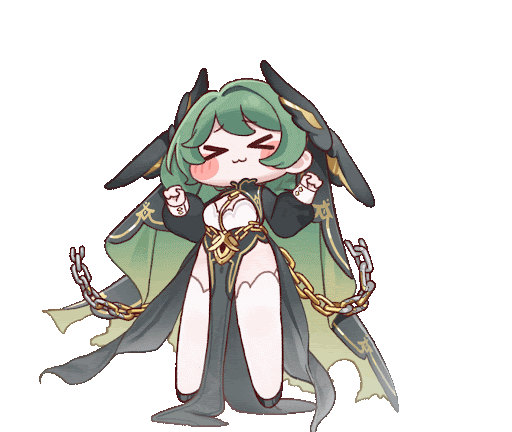

<!-- 헤더 이미지 -->

  

  

  

  

 

  
### 🌟 Quick Stats
  

---

## 🧑‍💻 About Me

  
<table>
<tr>
  <td>🌱</td>
  <td><b>Currently Learning</b></td>
  <td>C++, Python, TypeScript</td>
</tr>
<tr>
  <td>🎯</td>
  <td><b>Goal</b></td>
  <td>Becoming a full-stack developer</td>
</tr>
<tr>
  <td>🔭</td>
  <td><b>Current Focus</b></td>
  <td>learning new technologies</td>
</tr>
</table>

---

## 🚀 Tech Stack & Tools

### 💻 Languages

  
  
  
  

### 🛠️ Tools & Technologies

  
  
  
  
  
  
  
  
  
  
  

---

## 📊 GitHub Stats

  

---

## 💼 My Projects

> 🌟 **Check out my repositories!** If you find any of these projects useful or interesting, please consider giving them a **star ⭐**. Every bit of encouragement helps me keep building awesome things! 🚀

<!--START_SECTION:repos-->
<table>
  <tr>
    <td></td>
    <td></td>
  </tr>
  <tr>
    <td></td>
    <td></td>
  </tr>
  <tr>
    <td></td>
    <td></td>
  </tr>
</table>
<!--END_SECTION:repos-->

### 🆕 Latest Activity

  

---

## 📫 Connect with Me

  
  

  <i>💬 If you just want to talk, even if it's not about collaboration or coding, feel free to contact me anytime!</i>

---

## 🏗️ Repository Structure

```mermaid
graph TD
  A[reimunyancat] --> B[📁 Profile/]
  B --> C[🖼️ README.md]
  B --> D[🎨 Assets/]
  B --> E[📊 Workflows/]

  A --> REPO0[📝 Repository 1]
  A --> REPO1[📝 Repository 2]
  A --> REPO2[📝 Repository 3]
  A --> REPO3[📝 Repository 4]
  A --> REPO4[📝 Repository 5]
  A --> REPO5[📝 Repository 6]
  style A fill:#00b894,stroke:#55a3ff,stroke-width:3px,color:#fff
  style B fill:#41d885,stroke:#2ed573,stroke-width:2px,color:#fff
```

  
<b>✨ Fun Facts About Me</b>

   
  <table>
    <tr>
      <td>🔭</td>
      <td><b>Current Project</b></td>
      <td>Secret Project (Coming Soon!)</td>
    </tr>
    <tr>
      <td>☕</td>
      <td><b>Fuel</b></td>
      <td>black tea & Coffee</td>
    </tr>
  </table>

---

  
**Thanks for visiting my profile! 🚀**

